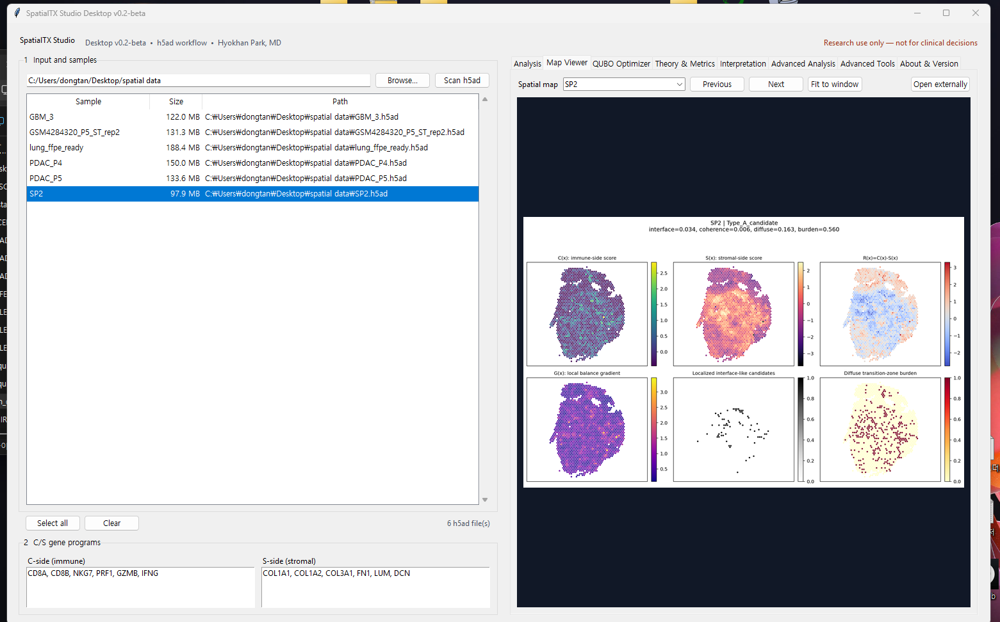

# SpatialTX Studio Desktop v0.2-beta

SpatialTX Studio Desktop is an open-source research workspace for exploratory spatial transcriptomics analysis. The release provides a local Python desktop application and command-line workflow for `.h5ad` inputs.

This software is a research prototype. It is not intended for diagnosis, treatment selection, or clinical decision-making. Outputs are exploratory and require independent review and validation.

## Screenshot



## v0.2-beta scope

- Local Python desktop application and CLI
- Single-sample and manifest-based batch processing
- Fixed, adaptive, and custom C/S gene-program modes
- Spatial C/S balance fields, transition summaries, QC reports, and maps
- Spot-based distance by default
- Opt-in advanced hypothesis-generation utilities
- A separate **Advanced Analysis** workspace for gene composition, interface enrichment, and local Cx/Sx spatial interaction
- Reproducible CSV tables, 300-dpi PNG figures, vector PDFs, and JSON analysis metadata

All v0.1-beta Transition Mapper functionality is retained. The fixed Cx and Sx definitions, scoring workflow, default thresholds, original CLI, and existing output contracts are unchanged.

## Core definitions

- `C(x)`: C-side gene-program score
- `S(x)`: S-side gene-program score
- `R(x) = C(x) - S(x)`: local C/S balance
- `G(x)`: local spatial gradient of the balance field

Interface-like and transition summaries are operational, exploratory candidates. They are not validated biological subtypes.

## Install and start

For the desktop GUI, install `requirements-desktop.txt`. For the legacy CLI workflow, install `requirements.txt`.

On Windows, run:

```text
install_desktop.bat
run_desktop.bat
```

Or install and launch with Python 3.11 or later:

```bash
python -m pip install -r requirements-desktop.txt
python desktop_app.py
```

See [README_DESKTOP.md](README_DESKTOP.md) for the desktop workflow and [README_local_run.md](README_local_run.md) for local CLI examples.

## Advanced Analysis quick start

In the desktop application, scan and select one or more `.h5ad` files, then open **Advanced Analysis**. The three nested tabs use the Cx/Sx genes and quantiles currently displayed in the main workspace.

The new command-line entry point is separate from the v0.1 CLI:

```bash
python advanced_cli.py --module composition --input sample.h5ad --output results
python advanced_cli.py --module enrichment --input sample.h5ad --output results
python advanced_cli.py --module interaction --input sample.h5ad --output results --permutations 499 --seed 20260705
```

See [RELEASE_NOTES_v0_2_beta.md](RELEASE_NOTES_v0_2_beta.md) for metric and output definitions.

## CLI quick start

Single sample:

```bash
python app_cli.py --input sample.h5ad --output results/sample1 --gene-mode fixed
```

Batch manifest:

```bash
python app_cli.py --manifest examples/sample_manifest.csv --output results/batch --gene-mode fixed
```

The manifest must contain `sample` and `input_path` columns. Optional per-row columns include `gene_mode` and `analysis`.

Typical outputs include metrics, QC summaries, selected-gene tables, run configuration and logs, and exploratory interface/transition maps. Output folders are generated at run time and are not included in this source release.

## Research-use guardrails

A3-A5 are optional hypothesis-generation utilities. They do not discover or validate drug responses, receptor function, membrane localization, ligand-receptor binding, biomarkers, biological subtypes, or clinical effects. See [DISCLAIMER.md](DISCLAIMER.md) and [RELEASE_NOTES_v0_1_beta.md](RELEASE_NOTES_v0_1_beta.md).


## Development note

AI-assisted tools were used for documentation support, code organization, and troubleshooting during development. All scientific definitions, software behavior, release decisions, and final review were performed by the author.

## References and related prior archive

Background references are listed in [REFERENCES.md](REFERENCES.md).

Earlier FRAME/ISTZ spatial transcriptomics analysis materials are archived at Zenodo: doi:10.5281/zenodo.19104105. This prior archive is provided for provenance and version lineage only. It is not included as a numbered peer-reviewed reference.

## License and citation

SpatialTX Studio Desktop is released under the Apache License 2.0. See [LICENSE](LICENSE), [THIRD_PARTY_LICENSES.md](THIRD_PARTY_LICENSES.md), and [CITATION.cff](CITATION.cff).
