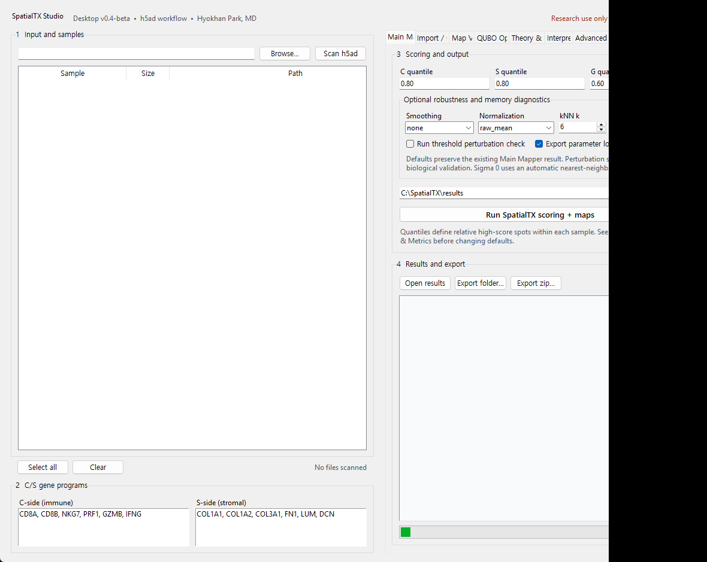
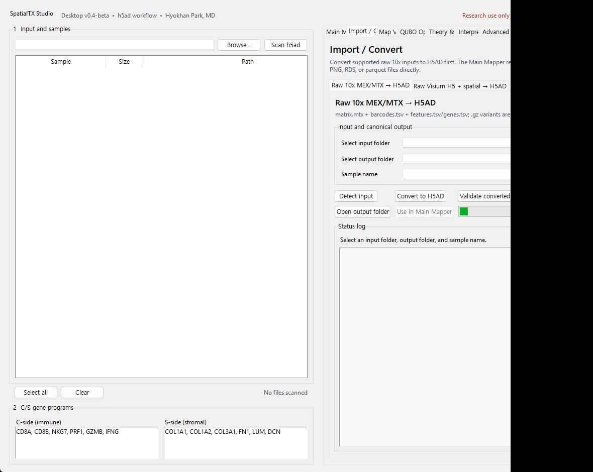
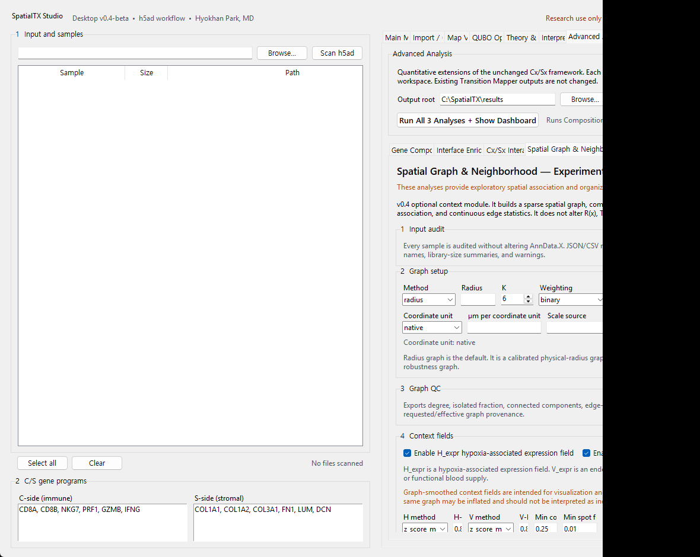

# SpatialTX Studio Desktop v0.4-beta

> Source-based beta release candidate. Exploratory research use only.

SpatialTX Studio Desktop is an open-source research workspace for exploratory spatial transcriptomics analysis. It provides a local Python desktop application and command-line workflow for `.h5ad` inputs.

This software is a research prototype. It is not intended for diagnosis, treatment selection, or clinical decision-making. Outputs are exploratory and require independent review and validation.

## v0.4-beta scope

- Local Python desktop application and CLI
- Single-sample and manifest-based batch processing
- Fixed, adaptive, and custom C/S gene-program modes
- Spatial C/S balance fields, transition summaries, QC reports, and maps
- Lightweight robustness and memory-safety diagnostics with conservative defaults
- Spot-based distance by default
- Opt-in advanced hypothesis-generation utilities
- A separate **Advanced Analysis** workspace for gene composition, interface enrichment, and local Cx/Sx spatial interaction
- Reproducible CSV tables, 300-dpi PNG figures, vector PDFs, and JSON analysis metadata
- A dedicated **Import / Convert** workspace for Raw 10x MEX/MTX and Raw Visium H5 + spatial conversion to canonical H5AD
- An optional **Spatial Graph & Neighborhood — Experimental** workflow for sparse graph QC, context fields, and exploratory neighborhood statistics
- Optional multi-seed QUBO stability analysis with selection frequency, consensus core genes, exact-k consensus, objective stability, R-field agreement, and pairwise overlap exports

The established Cx and Sx definitions, Main Mapper scoring workflow, default thresholds, Type A/B/C rules, and existing output contracts are unchanged. The FRAME2.6 CLI now delegates to that same canonical Main Mapper engine instead of maintaining an independent calculation.

## Core definitions

- `C(x)`: C-side gene-program score
- `S(x)`: S-side gene-program score
- `R(x) = C(x) - S(x)`: local C/S balance
- `G(x)`: local spatial gradient of the balance field

Interface-like and transition summaries are operational, exploratory candidates. They are not validated biological subtypes.

### C/S gene-program exclusivity

Official analyses require `C_genes ∩ S_genes = ∅`. Gene symbols are trimmed, converted to uppercase, de-duplicated within each program while preserving order, and checked again inside the canonical scoring engine. A gene present on both sides is a hard error because it can cancel in `R(x)=C(x)-S(x)` and create ambiguous composition results. Custom inputs must be corrected by the user; SpatialTX does not silently choose a side.

Fixed programs are checked as a development invariant. Adaptive and QUBO selection exclude genes already assigned to the opposite side and validate the final programs again. QUBO metadata records the exclusion constraint, excluded genes, and a final overlap count that must be zero. Successful Main Mapper, CLI, Advanced Analysis, and Spatial Graph outputs include gene-program validation provenance.

## Install and start

For the desktop GUI, install `requirements-desktop.txt`. For the legacy CLI workflow, install `requirements.txt`.

On Windows, run:

```text
install_desktop.bat
run_desktop.bat
```

Or install and launch with Python 3.11 or later:

```bash
python -m pip install -r requirements-desktop.txt
python desktop_app.py
```

See [README_DESKTOP.md](README_DESKTOP.md) for the desktop workflow and [README_local_run.md](README_local_run.md) for local CLI examples.

## Screenshot

Main Mapper:



Import / Convert:



Advanced Analysis → Spatial Graph & Neighborhood — Experimental:



## Import / Convert

The Main Mapper remains H5AD-centered. Raw data must first be converted in **Import / Convert**, then opened in the Main Mapper like any other `.h5ad` input.

- **Raw 10x MEX/MTX → H5AD**: `matrix.mtx`, `barcodes.tsv`, and `features.tsv`/`genes.tsv`, including supported `.gz` variants.
- **Raw Visium H5 + spatial → H5AD**: `filtered_feature_bc_matrix.h5`, tissue positions, scalefactors, and optional tissue images, including supported `.gz` spatial files and GEO-style filename prefixes.

Each section provides input/output selection, sample naming, conversion, H5AD validation, output-folder access, a status log, and Main Mapper handoff. Seurat RDS, h5Seurat, parquet, and generic CSV import are not supported.

## Advanced Analysis quick start

In the desktop application, scan and select one or more `.h5ad` files, then open **Advanced Analysis**. The established composition, enrichment, and interaction tabs use the Cx/Sx genes and quantiles currently displayed in the main workspace.

v0.4-beta also adds **Spatial Graph & Neighborhood — Experimental** as a separate opt-in tab. It builds sparse radius, Visium-lattice, or symmetric-KNN graphs; distinguishes native-coordinate from calibrated physical radius; reports input/graph/context QC; optionally calculates `H_expr` and `V_expr` context fields; and exports separate same-spot, neighboring-spot, and continuous edge association statistics. These context fields do not modify `R(x)`, Type A/B/C labels, or transition masks.

The Advanced Analysis command-line entry point remains separate from the core CLI:

```bash
python advanced_cli.py --module composition --input sample.h5ad --output results
python advanced_cli.py --module enrichment --input sample.h5ad --output results
python advanced_cli.py --module interaction --input sample.h5ad --output results --permutations 499 --seed 20260705
python advanced_cli.py --module spatial_graph --input sample.h5ad --output results --graph-method radius --permutations 999 --seed 20260713
```

See [RELEASE_NOTES_v0_4_beta.md](RELEASE_NOTES_v0_4_beta.md) for beta stabilization notes. The previous public source release notes remain in [RELEASE_NOTES_v0_3_beta.md](RELEASE_NOTES_v0_3_beta.md).

## CLI quick start

Single sample:

```bash
python app_cli.py --input sample.h5ad --output results/sample1 --gene-mode fixed
```

Batch manifest:

```bash
python app_cli.py --manifest examples/sample_manifest.csv --output results/batch --gene-mode fixed
```

The manifest must contain `sample` and `input_path` columns. Optional per-row columns include `gene_mode` and `analysis`.

Typical outputs include metrics, QC summaries, selected-gene tables, run configuration and logs, and exploratory interface/transition maps. Output folders are generated at run time and are not included in this source release.

The QUBO Optimizer supports a reproducible single-seed run and an optional multi-seed stability run. The default is 1,000 simulated-annealing iterations. Multi-seed mode repeats sequential seeds, reports `QUBO energy (lower is better)`, and separates frequency-based consensus core genes from a deterministic exact-k consensus set. Consensus reflects computational stability for the selected sample, candidate pool, objective weights, and parameters; it is not biological validation or proof of a uniquely optimal gene program.

For C/S exclusivity, the optimizer implements the constraint `x_C,g + x_S,g <= 1` by removing opposite-side genes from the candidate pool before optimization and validating the selected program afterward.

## Research-use guardrails

A3-A5 are optional hypothesis-generation utilities. They do not discover or validate drug responses, receptor function, membrane localization, ligand-receptor binding, biomarkers, biological subtypes, or clinical effects. See [DISCLAIMER.md](DISCLAIMER.md) and [RELEASE_NOTES_v0_4_beta.md](RELEASE_NOTES_v0_4_beta.md).

## Spatial Graph and Neighborhood Analysis

See [docs/SPATIAL_GRAPH_NEIGHBORHOOD.md](docs/SPATIAL_GRAPH_NEIGHBORHOOD.md), [docs/INPUT_AUDIT_AND_VARIABLE_SEMANTICS.md](docs/INPUT_AUDIT_AND_VARIABLE_SEMANTICS.md), and [docs/OUTPUT_SCHEMA_v0_4.md](docs/OUTPUT_SCHEMA_v0_4.md).

Use cautious interpretation:

- `H_expr` is a hypoxia-associated expression field.
- `V_expr` is an endothelial/angiogenic expression proxy, not vessel density, perfusion, vascularity, or functional blood supply.
- Neighborhood enrichment P-values and FDR values describe exploratory spatial association, not causal biological interaction.
- Graph-smoothed context fields are intended for visualization and exploratory sensitivity analysis. Association statistics computed on fields smoothed over the same graph may be inflated and should not be interpreted as independent confirmatory evidence.
- Permutation P-values are exploratory and rely on exchangeability assumptions. They do not fully preserve the original spatial autocorrelation structure.
- BH-FDR is calculated within one sample and one analysis table (`within_sample_within_analysis_table`), not jointly across samples, graph types, analysis families, or robustness runs.


## Development note

AI-assisted tools were used for documentation support, code organization, and troubleshooting during development. All scientific definitions, software behavior, release decisions, and final review were performed by the author.

## References and related prior archive

Background references are listed in [REFERENCES.md](REFERENCES.md).

Earlier FRAME/ISTZ spatial transcriptomics analysis materials are archived at Zenodo: doi:10.5281/zenodo.19104105. This prior archive is provided for provenance and version lineage only. It is not included as a numbered peer-reviewed reference.

## License and citation

SpatialTX Studio Desktop is released under the Apache License 2.0. See [LICENSE](LICENSE), [THIRD_PARTY_LICENSES.md](THIRD_PARTY_LICENSES.md), and [CITATION.cff](CITATION.cff).
