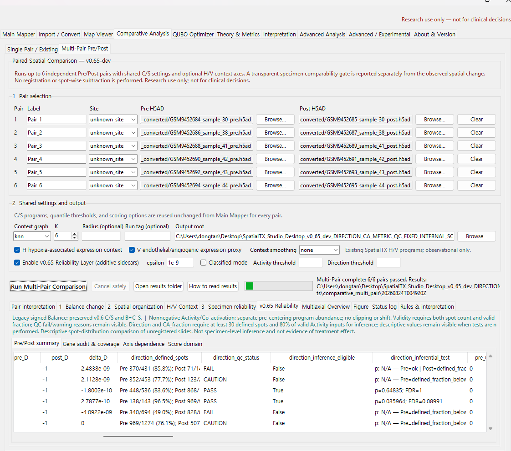
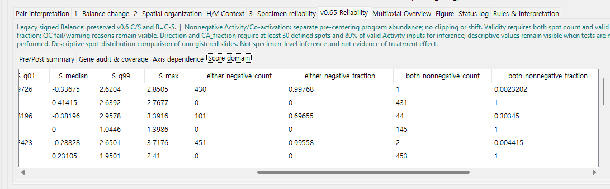
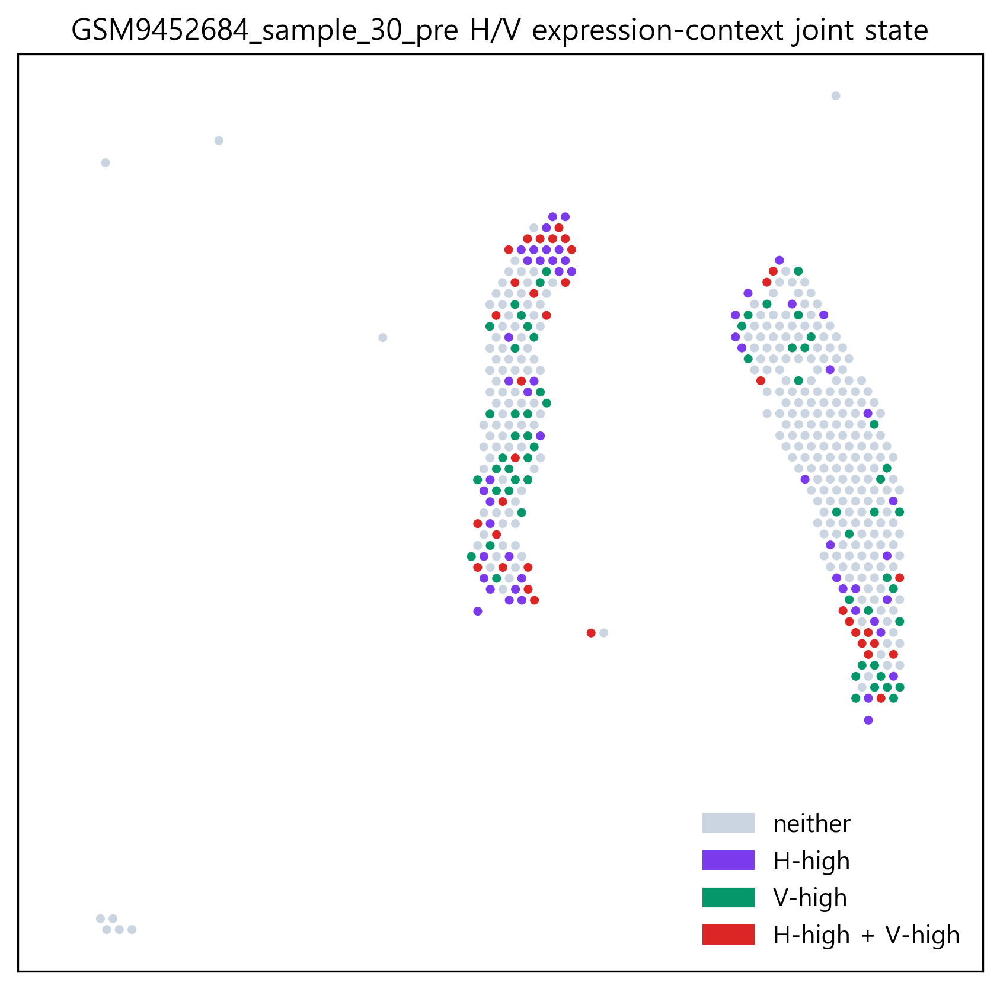

# SpatialTX Studio Desktop v0.65

> Public research release preserving the v0.6-beta baseline. Exploratory research use only.

SpatialTX Studio Desktop is an open-source research workspace for exploratory spatial transcriptomics analysis. It provides a local Python desktop application and command-line workflow for `.h5ad` inputs.

This software is a research prototype. It is not intended for diagnosis, treatment selection, or clinical decision-making. Outputs are exploratory and require independent review and validation.

## What is new in v0.65

v0.65 adds a **default-off, additive Multi-axis Reliability Layer** to Multi-Pair Pre/Post. Legacy Balance reads the existing signed v0.6 C/S arrays unchanged. Activity/Direction/Co-activation use a separate pre-z-score nonnegative program mean from the same genes and missing-gene policy. Neither source overwrites C/S/R, spatial masks, H/V context, comparability, Type A/B/C, or established output files.

Direction and CA_fraction now have a separate metric-level support gate: both Pre and Post require at least 30 defined spots and at least 80% of valid Activity inputs before CI/p/FDR are produced. Descriptive values remain visible when support is insufficient, while unavailable inference stays `NaN` in exports and `N/A` in the GUI. See [the metric-level QC audit](docs/RELIABILITY_METRIC_LEVEL_QC_V065.md).

- Continuous Balance, Activity, Direction, co-activation strength, and co-activation fraction sidecars.
- Explicit negative/non-finite/zero-activity handling; undefined values remain `NA`.
- Optional four-state classification only with user-supplied Activity and Direction thresholds.
- Strict canonical cross-exclusivity, gene coverage QC, and non-transforming dependence QC.
- A `v0.65 Reliability` UI tab with explicit source/domain labels, validity reasons, and score-domain diagnostics.
- A count-and-fraction score-domain gate (`30` spots, `80%` valid; warning below `80%`, QC fail below `50%`) with no clipping, shifting, or learned cohort correction.
- Explicit descriptive-only inference flags for unregistered slides; no specimen-level or treatment-effect claim is allowed.

See [v0.65 Reliability Layer documentation](docs/RELIABILITY_LAYER_V065.md) for formulas, output schemas, validation results, and limitations.

## What is new in v0.6-beta

v0.6-beta adds **Multiaxial Comparative Analysis + QC-aware paired interpretation** and makes focal H/V context auditable. It is computational validation and output auditing, not biological validation.

- Resolves and records the effective existing default or user-supplied H/V gene programs.
- Exports one H/V coverage and status row per sample in `context_gene_audit.csv`.
- Distinguishes valid zero values from unavailable `NaN` values using explicit statuses.
- Retains backward-compatible H/V raw medians and adds raw mean, q75, q90, transition enrichment, coefficient of variation, pair-pooled high-context fraction, and local high-context fraction.
- Uses one q90 threshold from pooled Pre+Post values within each individual pair; thresholds are never pooled across different patients.
- Bumps the comparative cache schema to `v0.6-hv-validation-v1`.
- Does not modify C/S/R, FRAME2.6, Type A/B/C, spatial metrics, comparability QC, or site warnings.

### Multiaxial comparative foundation

v0.6-beta extends the preserved v0.5.5 Multi-Pair workflow. The primary model remains `C(x)`, `S(x)`, and `R(x)=C(x)-S(x)` with unchanged FRAME2.6 Type A/B/C candidate rules.

- The existing H and V programs are available as optional parallel axes in paired analysis: H is hypoxia-associated expression context; V is an endothelial/angiogenic expression proxy, not perfusion or measured vascularity.
- Every pair displays its biological/spatial result beside specimen comparability (`Good`, `Caution`, or `Low`) and rule-based interpretation confidence. `Low` does not suppress the result; it adds an explicit caution against direct biological or treatment attribution.
- Each pair accepts `same_site`, `different_site`, or `unknown_site`. `different_site` produces a visible `SITE-SHIFT WARNING` without excluding the pair.
- New raw-value exports are `multiaxial_pair_summary.csv`, `comparative_qc_summary.csv`, `context_changes.csv`, and `figures/multiaxial_pair_overview.png`.
- The multiaxial overview keeps C/S balance, spatial organization, and H/V context in independent panels with centered zero lines and exact Delta labels. It does not calculate a composite response score.
- H/V are optional. Missing context genes are exported as `NaN/not available` and do not interrupt C/S/FRAME2.6 analysis.
- H/V never alter C/S/R, transition masks, interface/diffuse metrics, transition burden, or Type A/B/C candidate labels.

## Preserved v0.5.5-beta foundation

The v0.5.5-beta implementation remains preserved as the stable checkpoint. Its Main Mapper, `C(x)`, `S(x)`, `R(x)=C(x)-S(x)`, Type A/B/C candidate rules, importers, Single Pair workflow, and experimental tools remain available without a biological-model redesign.

- **Multi-Pair Pre/Post** runs one to six independent Pre/Post pairs with one shared set of C/S genes, thresholds, scoring options, and graph settings.
- Results are organized as three non-composite layers: **1 Balance change** (`C`, `S`, `R=C-S`), **2 Spatial organization change** (interface, diffuse, adjacency, fragmentation, and topology), and **3 Specimen reliability** (comparability plus technical/sampling QC).
- A **Pair interpretation** panel assigns transparent `Minimal`, `Moderate`, or `Large` descriptive change classes, reports `regime_preserved` and `structure_preserved`, and displays a reliability-qualified interpretive flag. Thresholds are centralized in `PairInterpretationConfig`; these labels are not treatment-response classes.
- Compact reliability output shows the actual spot-count, detected-gene, observed-count, spatial-extent, tissue-component, and occupancy comparisons where available, with technical and sampling/composition-proxy reasons separated.
- A conservative filename check warns about a possible patient/sample pair-ID mismatch before running. It does not treat accessions alone as patient IDs and does not automatically block or reclassify a comparison.
- Every successful pair retains separate Pre, Post, Delta, percent-change status, and direction fields for C, S, R, interface, diffuse, transition burden, adjacency, and compatible topology metrics. Primary C/S/R state rows use existing field medians; near-zero-centered means remain separate compatibility columns.
- A transparent **Comparability Gate** reports `Good`, `Caution`, or `Low` separately from the observed change. It prioritizes technical quality and tissue-sampling differences; C/S distribution proxies are secondary and cannot alone produce `Low`.
- A failed or corrupted pair is recorded as `ERROR` without terminating the other selected pairs.
- Exports retain `pair_results.csv` for compatibility and add layer-specific tables plus `pair_interpretation_summary.csv`, `comparability_details.csv`, and `overview_interpretation.csv`, alongside detailed QC, metadata, and figures.
- The Multi-Pair screen includes **How to read results** and **Rules & interpretation**, which explain Delta direction, C/S/R summaries, Good/Caution/Low comparability logic, default thresholds, missing-QC handling, and interpretation limits inside the application.
- Direction arrows use metric-specific near-zero tolerances while exact numeric values remain in the CSV exports.
- Side-by-side R-map footer spacing is corrected so the transition-outline legend no longer overlaps run metadata.
- The raw comparative overview uses two independent x-axes: **Primary spatial-state summary metrics** for fraction/score/ratio changes and **Topology / component complexity metrics** for component densities. Numeric Delta labels are printed on every bar.
- Eligible group analyses also export an optional pooled-sample-scale standardized two-panel view. Raw Delta remains the default; pairwise standardized change is not computed from only two observations.

Observed changes remain descriptive. Comparability is specimen/sampling context, not a probability that a biological interpretation is true. The workflow does not calculate treatment response rate, therapeutic efficacy, responder status, drug sensitivity, or predictive accuracy.

## Preserved v0.5 comparative foundation

v0.5-beta adds **Comparative Spatial Transition Analysis** without changing the established single-sample Main Mapper. It compares sample-level summaries for pairwise, paired-group, unpaired-group, and CSV-manifest designs. AnnData `.h5ad` remains the canonical analysis input.

- Delta direction is always `Target - Reference`; positive values mean Target is higher.
- Default group inference uses Wilcoxon signed-rank for paired data and Mann-Whitney U for unpaired data, with effect sizes, seeded bootstrap confidence intervals, and Benjamini-Hochberg FDR.
- Operational Type A/B/C candidate changes are descriptive, confidence-flagged summaries, not validated biological state transitions.
- Comparative maps are side-by-side displays only. No direct spatial registration or spot-wise subtraction is performed.
- Optional `H_expr` and `V_expr` are observational context only and never alter `C(x)`, `S(x)`, `R(x)`, transition masks, or candidate regime labels.
- Comparative figures are separated by metric category. Existing raw topology counts are preserved alongside sample-scale context, normalized component densities, stable relative-change views, and explicit scale warnings.
- Centered H/V sample means are retained only for compatibility and excluded from primary interpretation; available non-centered H/V summaries use a pooled reference/target threshold and remain observational only.
- Timestamped CSV, JSON, HTML, PDF, logs, fresh figures, input hashes, warnings, failures, and environment metadata are exported.

The comparative workflow does not add candidate discovery, ligand-receptor analysis, comparative QUBO, AI/ML diagnosis, or literature search. v0.6 reuses the existing H/V definitions rather than inventing new axes. See [Comparative Analysis documentation](docs/COMPARATIVE_ANALYSIS.md).

## Preserved v0.4.1 capabilities

- Local Python desktop application and CLI
- Single-sample and manifest-based batch processing
- Fixed, adaptive, and custom C/S gene-program modes
- Spatial C/S balance fields, transition summaries, QC reports, and maps
- Lightweight robustness and memory-safety diagnostics with conservative defaults
- Spot-based distance by default
- Opt-in advanced hypothesis-generation utilities
- A separate **Advanced Analysis** workspace for gene composition, interface enrichment, and local Cx/Sx spatial interaction
- Reproducible CSV tables, 300-dpi PNG figures, vector PDFs, and JSON analysis metadata
- A dedicated **Import / Convert** workspace for Raw 10x MEX/MTX, Raw Visium H5 + spatial, and prefix-grouped GEO flat Visium conversion to canonical H5AD
- An optional **Spatial Graph & Neighborhood — Experimental** workflow for sparse graph QC, context fields, and exploratory neighborhood statistics
- An in-app **Spatial Graph Results** viewer for generated graph/context figures, H_expr/V_expr context QC, failed-sample summaries, and direct result-file access
- Optional multi-seed QUBO stability analysis with selection frequency, consensus core genes, exact-k consensus, objective stability, R-field agreement, and pairwise overlap exports

The established Cx and Sx definitions, Main Mapper scoring workflow, default thresholds, Type A/B/C rules, and existing output contracts are unchanged. The FRAME2.6 CLI now delegates to that same canonical Main Mapper engine instead of maintaining an independent calculation.

## Core definitions

- `C(x)`: C-side gene-program score
- `S(x)`: S-side gene-program score
- `R(x) = C(x) - S(x)`: local C/S balance
- `G(x)`: local spatial gradient of the balance field

Interface-like and transition summaries are operational, exploratory candidates. They are not validated biological subtypes.

### C/S gene-program exclusivity

Official analyses require `C_genes ∩ S_genes = ∅`. Gene symbols are trimmed, converted to uppercase, de-duplicated within each program while preserving order, and checked again inside the canonical scoring engine. A gene present on both sides is a hard error because it can cancel in `R(x)=C(x)-S(x)` and create ambiguous composition results. Custom inputs must be corrected by the user; SpatialTX does not silently choose a side.

Fixed programs are checked as a development invariant. Adaptive and QUBO selection exclude genes already assigned to the opposite side and validate the final programs again. QUBO metadata records the exclusion constraint, excluded genes, and a final overlap count that must be zero. Successful Main Mapper, CLI, Advanced Analysis, and Spatial Graph outputs include gene-program validation provenance.

## Install and start

For the desktop GUI, install `requirements-desktop.txt`. For the legacy CLI workflow, install `requirements.txt`.

On Windows, run:

```text
install_desktop.bat
run_desktop.bat
```

Or install and launch with Python 3.11 or later:

```bash
python -m pip install -r requirements-desktop.txt
python desktop_app.py
```

See [README_DESKTOP.md](README_DESKTOP.md) for the desktop workflow and [README_local_run.md](README_local_run.md) for local CLI examples.

## Comparative Analysis quick start

Select two analyzed H5AD samples in Main Mapper, then open **Comparative Analysis** for a pairwise run. For group designs, load a manifest containing `sample_id`, `file_path`, and `group`; paired designs also require `pair_id`.

For one to six independent Pre/Post comparisons, open **Comparative Analysis → Multi-Pair Pre/Post**, select a label plus Pre and Post H5AD for each row, keep one shared parameter set, and select **Run Multi-Pair Comparison**. Empty rows are ignored; partially filled rows are reported. Review **1 Balance change**, **2 Spatial organization**, and **3 Specimen reliability** as separate result layers. Select **How to read results** at any time to open the in-app classification rules and thresholds. The application does not collapse the three layers into an overall response or clinical score.

Review the sample-scale banner and normalized topology figures before interpreting raw component-count changes. Pairwise regime results use a descriptive transition card; paired cohorts retain a count-and-row-percentage transition matrix. All deltas remain `Target - Reference`, and the original raw metric values remain exported.

```bash
spatialtx compare --sample-a sample_A.h5ad --sample-b sample_B.h5ad --outdir results_pairwise --seed 42
```

```bash
spatialtx compare --manifest examples/comparative_manifest_example.csv --mode paired --reference pre --target post --outdir results_v05 --seed 42
```

Required output files include sample metrics, delta metrics, group statistics, operational regime transitions, warnings, run manifest, parameter JSON, HTML/PDF reports, figures, and logs. Statistical significance alone is not evidence of biological or clinical significance.

## v0.65 screenshots

Multi-Pair Reliability workspace after the Direction/CA_fraction metric-level QC correction. Defined-spot support, PASS/CAUTION/FAIL status, inferential eligibility, and `p: N/A` reasons remain visible beside descriptive values:



Score-domain audit separating preserved signed legacy Balance inputs from the nonnegative Activity source used by Activity, Direction, and Co-activation:



Example H/V expression-context joint-state map. H/V are observational context fields and do not modify C/S/R, transition masks, or Type A/B/C candidate labels:



## v0.6-beta screenshots

These screenshots were captured during final v0.6 development testing and may show the internal `v0.6-dev-HV-validation` build label. The published source identifies itself as `v0.6-beta`.

Multi-Pair Pre/Post workspace with six independent pairs and the non-composite multiaxial overview:


Raw multiaxial change profile. C/S balance, spatial organization, raw H/V median Delta, and pair-pooled high-context fraction Delta remain separate:


H/V observational context summary using pooled reference/target thresholds:


Example H/V expression-context joint-state map. H/V remain observational and do not alter C/S/R or Type A/B/C calls:


## Preserved v0.5-beta screenshots

These retained screenshots document the preserved v0.5 workflows.

Comparative Analysis workspace with category-specific metric changes:


Side-by-side `R(x) = C(x) - S(x)` maps. These panels are descriptive displays; no registration or spot-wise subtraction is performed:


GEO Flat Visium Directory inventory and conversion workflow:


## Import / Convert

The Main Mapper remains H5AD-centered. Raw data must first be converted in **Import / Convert**, then opened in the Main Mapper like any other `.h5ad` input.

- **Raw 10x MEX/MTX → H5AD**: `matrix.mtx`, `barcodes.tsv`, and `features.tsv`/`genes.tsv`, including supported `.gz` variants.
- **Raw Visium H5 + spatial → H5AD**: `filtered_feature_bc_matrix.h5`, tissue positions, scalefactors, and optional tissue images, including supported `.gz` spatial files and GEO-style filename prefixes.
- **GEO Flat Visium Directory**: scans any user-selected readable directory, groups standard MEX/spatial files by their exact full filename prefix, validates every detected sample, and converts only explicitly selected valid samples.

The flat-directory importer never groups by accession alone, does not merge similar prefixes such as `sample_3` and `sample_30`, does not auto-pair pre/post names, and writes nothing into the source directory. Filename-derived subject/condition metadata remains unconfirmed until the user reviews and confirms a draft comparative manifest. See [GEO Flat Visium Import](docs/GEO_FLAT_VISIUM_IMPORT.md).

Each section provides runtime input/output selection, conversion and validation feedback, output-folder access, and Main Mapper handoff. Seurat RDS, h5Seurat, parquet, and generic CSV import are not supported.

## Advanced Analysis quick start

In the desktop application, scan and select one or more `.h5ad` files, then open **Advanced Analysis**. The established composition, enrichment, and interaction tabs use the Cx/Sx genes and quantiles currently displayed in the main workspace.

The v0.4 line adds **Spatial Graph & Neighborhood — Experimental** as a separate opt-in tab. It builds sparse radius, Visium-lattice, or symmetric-KNN graphs; distinguishes native-coordinate from calibrated physical radius; reports input/graph/context QC; optionally calculates `H_expr` and `V_expr` context fields; and exports separate same-spot, neighboring-spot, and continuous edge association statistics. These context fields do not modify `R(x)`, Type A/B/C labels, or transition masks.

v0.4.1-beta adds an in-app Spatial Graph Results viewer. After Spatial Graph & Neighborhood analysis completes, generated Graph QC, H_expr, V_expr, H/V joint-state, and neighborhood enrichment figures can be reviewed directly inside the desktop application. The viewer is a read-only UI over the existing generated files: PNG, CSV, and JSON outputs remain in the timestamped output folder, and the output schema remains v0.4. H_expr and V_expr remain descriptive context fields and do not change Main Mapper `R(x)`, Type A/B/C calls, or transition masks.

The Advanced Analysis command-line entry point remains separate from the core CLI:

```bash
python advanced_cli.py --module composition --input sample.h5ad --output results
python advanced_cli.py --module enrichment --input sample.h5ad --output results
python advanced_cli.py --module interaction --input sample.h5ad --output results --permutations 499 --seed 20260705
python advanced_cli.py --module spatial_graph --input sample.h5ad --output results --graph-method radius --permutations 999 --seed 20260713
```

See [RELEASE_NOTES_v0_65.md](RELEASE_NOTES_v0_65.md) for the current public release, [RELEASE_NOTES_v0_6_beta.md](RELEASE_NOTES_v0_6_beta.md) for the public baseline, [RELEASE_NOTES_v0_6_dev_HV_validation.md](RELEASE_NOTES_v0_6_dev_HV_validation.md) and [RELEASE_NOTES_v0_6_dev.md](RELEASE_NOTES_v0_6_dev.md) for development lineage, and [RELEASE_NOTES_v0_5_5_beta.md](RELEASE_NOTES_v0_5_5_beta.md) for the preserved Multi-Pair foundation.

## CLI quick start

Single sample:

```bash
python app_cli.py --input sample.h5ad --output results/sample1 --gene-mode fixed
```

Batch manifest:

```bash
python app_cli.py --manifest examples/sample_manifest.csv --output results/batch --gene-mode fixed
```

The manifest must contain `sample` and `input_path` columns. Optional per-row columns include `gene_mode` and `analysis`.

Typical outputs include metrics, QC summaries, selected-gene tables, run configuration and logs, and exploratory interface/transition maps. Output folders are generated at run time and are not included in this source release.

The QUBO Optimizer supports a reproducible single-seed run and an optional multi-seed stability run. The default is 1,000 simulated-annealing iterations. Multi-seed mode repeats sequential seeds, reports `QUBO energy (lower is better)`, and separates frequency-based consensus core genes from a deterministic exact-k consensus set. Consensus reflects computational stability for the selected sample, candidate pool, objective weights, and parameters; it is not biological validation or proof of a uniquely optimal gene program.

For C/S exclusivity, the optimizer implements the constraint `x_C,g + x_S,g <= 1` by removing opposite-side genes from the candidate pool before optimization and validating the selected program afterward.

## Research-use guardrails

A3-A5 are optional hypothesis-generation utilities. A3 is a non-spatial Reference/Target expression and detection-fraction contrast; use Comparative Analysis for C/S/R spatial sample or group comparisons. The earlier filename-based A1 pre/post pair scanner is no longer displayed in Advanced / Experimental. These utilities do not discover or validate drug responses, receptor function, membrane localization, ligand-receptor binding, biomarkers, biological subtypes, or clinical effects. See [DISCLAIMER.md](DISCLAIMER.md) and [RELEASE_NOTES_v0_5_beta.md](RELEASE_NOTES_v0_5_beta.md).

## Spatial Graph and Neighborhood Analysis

See [docs/SPATIAL_GRAPH_NEIGHBORHOOD.md](docs/SPATIAL_GRAPH_NEIGHBORHOOD.md), [docs/INPUT_AUDIT_AND_VARIABLE_SEMANTICS.md](docs/INPUT_AUDIT_AND_VARIABLE_SEMANTICS.md), and [docs/OUTPUT_SCHEMA_v0_4.md](docs/OUTPUT_SCHEMA_v0_4.md).

Use cautious interpretation:

- `H_expr` is a hypoxia-associated expression field.
- `V_expr` is an endothelial/angiogenic expression proxy, not vessel density, perfusion, vascularity, or functional blood supply.
- Neighborhood enrichment P-values and FDR values describe exploratory spatial association, not causal biological interaction.
- Graph-smoothed context fields are intended for visualization and exploratory sensitivity analysis. Association statistics computed on fields smoothed over the same graph may be inflated and should not be interpreted as independent confirmatory evidence.
- Permutation P-values are exploratory and rely on exchangeability assumptions. They do not fully preserve the original spatial autocorrelation structure.
- BH-FDR is calculated within one sample and one analysis table (`within_sample_within_analysis_table`), not jointly across samples, graph types, analysis families, or robustness runs.


## Development note

AI-assisted tools were used for documentation support, code organization, and troubleshooting during development. All scientific definitions, software behavior, release decisions, and final review were performed by the author.

## References and related prior archive

Background references are listed in [REFERENCES.md](REFERENCES.md).

Earlier FRAME/ISTZ spatial transcriptomics analysis materials are archived at Zenodo: doi:10.5281/zenodo.19104105. This prior archive is provided for provenance and version lineage only. It is not included as a numbered peer-reviewed reference.

## License and citation

SpatialTX Studio Desktop is released under the Apache License 2.0. See [LICENSE](LICENSE), [THIRD_PARTY_LICENSES.md](THIRD_PARTY_LICENSES.md), and [CITATION.cff](CITATION.cff).
