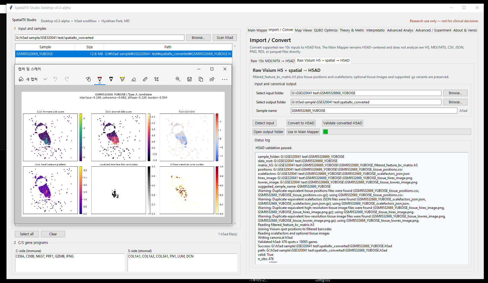

# SpatialTX Studio Desktop v0.3-beta

> Public source release for GitHub distribution.

v0.3-beta introduces the **Import / Convert** architecture and lightweight robustness/memory-safety diagnostics while preserving the established Main Mapper and Advanced Analysis behavior. Advanced Analysis includes Gene Composition, Interface Enrichment, and Cx/Sx Interaction modules that write only to separate timestamped `advanced_*` folders.

Windows desktop research prototype for the main `.h5ad` SpatialTX workflow.

- Creator: **Hyokhan Park, MD**
- Version: **v0.3-beta**
- Release date: **2026-07-08**
- Edition: **Public v0.3-beta source release**



## Start on Windows

1. Double-click `install_desktop.bat` once to install the Python dependencies.
2. Double-click `run_desktop.bat` to open the application.

If dependencies are already installed, you can start it directly:

```powershell
python desktop_app.py
```

The launcher checks common Miniconda and Anaconda locations before the system Python.

## Import / Convert: raw inputs to H5AD

SpatialTX Studio uses AnnData .h5ad as its canonical analysis format. Raw 10x/Visium-format data can be imported through the Import / Convert workflow, which generates SpatialTX-compatible .h5ad files before analysis.

The Main Mapper does not analyze raw H5, MEX/MTX, CSV, JSON, PNG, RDS, or parquet files directly.

### Raw 10x MEX/MTX → H5AD

Select a folder containing:

- `matrix.mtx` or `matrix.mtx.gz`
- `barcodes.tsv` or `barcodes.tsv.gz`
- `features.tsv`, `features.tsv.gz`, `genes.tsv`, or `genes.tsv.gz`

If a compatible tissue-position table is available, its coordinates are attached. A MEX/MTX dataset without coordinates can still be converted for expression-only scoring, but H5AD validation reports a warning and spatial regimes, metrics, and maps remain unavailable.

### Raw Visium H5 + spatial → H5AD

Select a 10x/Visium sample folder containing:

- `filtered_feature_bc_matrix.h5`
- `spatial/tissue_positions.csv` or `tissue_positions.csv.gz`
- `spatial/scalefactors_json.json` or `scalefactors_json.json.gz`

Standard Space Ranger names and GEO-style prefixed names ending in these Visium filenames are accepted, for example `GSM9532669_SAMPLE_filtered_feature_bc_matrix.h5` and `GSM9532669_SAMPLE_tissue_positions.csv.gz`. Hires and lowres tissue PNG files are optional; uncompressed `.png` and `.png.gz` are supported.

### Shared conversion controls

Both importer sections provide **Select input folder**, **Select output folder**, **Sample name**, **Convert to H5AD**, **Validate converted H5AD**, **Open output folder**, **Use in Main Mapper**, and a status log. Successful conversion writes `<output_dir>/<sample_name>.h5ad`.

Seurat RDS, h5Seurat, parquet, and generic CSV import are not supported.

## Workflow

1. Choose a folder and scan recursively for `.h5ad` files.
2. Select one or more samples in the table.
3. Edit the C-side and S-side gene programs if needed.
4. Run scoring to create a summary CSV, per-sample metrics, selected-gene tables, and six-panel PNG maps.
5. Select exactly one sample to optimize either the C-side or S-side program.
6. Apply the optimized genes and recompute/redraw the selected samples.
7. Export the latest result as a folder or ZIP archive.

The application includes nine working tabs and is designed around a Full HD desktop:

- **Main Mapper** — H5AD inputs, C/S programs, thresholds, scoring execution, logs, and export
- **Import / Convert** — converts Raw 10x MEX/MTX or Raw Visium H5 + spatial inputs to canonical H5AD before analysis
- **Map Viewer** — displays generated PNG maps inside the application with sample navigation and fit-to-window scaling
- **QUBO Optimizer** — independent C/S optimization and application, per-side or combined restoration of the original fixed gene sets, followed by explicit recompute and map redraw
- **Theory & Metrics** — the C/S/R/G model, interface rules, regimes, metric interpretation, optimizer rationale, and the assumptions and limitations of Advanced Analysis
- **Interpretation** — a sample summary table, automatically generated result explanation, gene-coverage warning, review checklist, and direct access to each PNG map
- **Advanced Analysis** — gene composition, interface enrichment, local Cx/Sx spatial interaction, and a results dashboard
- **Advanced / Experimental** — opt-in hypothesis-generation comparisons, heuristic candidate filtering, and local ligand/receptor utility exports
- **About & Version** — creator, current version/date, release description, and research-use notice

### QUBO option guide

- **Genes (k)**: fixed number of genes selected for the optimized side. Smaller values produce a more compact program; larger values retain broader signal but may add redundancy. Default: 8.
- **Pool**: maximum candidate genes considered by the optimizer. A larger pool broadens the search but increases computation and potential instability. Default: 40.
- **Iterations**: simulated-annealing swap attempts. More iterations can improve the search at the cost of runtime; this does not change the requested number of selected genes. Default: 300.
- **Seed**: fixes the random search path for reproducible selection with identical input and settings. Default: 20260624.

### How QUBO optimization works

1. Build a bounded candidate gene pool.
2. Score genes for C/S alignment, directional `R`, gradient association, spatial enrichment, detection, and variance.
3. Penalize opposite-side overlap, low detection, and redundant gene pairs.
4. Formulate a binary optimization problem that selects exactly `k` genes.
5. Solve it locally with a classical simulated-annealing heuristic.
6. Apply the selected program, recompute the C/S fields, and redraw the maps.

QUBO does not simply rank genes independently. It selects a complementary combination that explains the requested spatial direction while limiting redundancy.

The scoring implementation uses per-gene z-scores, C/S program means, `R=C-S`, a six-neighbor spatial graph, local balance gradient `G`, and quantile-based localized-interface and diffuse-transition calls. The optimizer uses a side-aware, fixed-cardinality QUBO-inspired objective with a classical simulated-annealing fallback. It is not a quantum backend.

Every scored sample receives a `QC_flag`, `spatial_qc_status`, and machine-readable `QC_notes`. Checks cover C/S gene coverage, coordinate validity, unique feature names, C/S program overlap, and very small spot counts.

If `adata.obsm["spatial"]` is missing, empty, non-finite, or not shaped `(n_obs, 2)`, the Main Mapper does not invent fallback geometry. Expression-only C/S/R scoring remains available when gene-program coverage is sufficient, while the regime is set to `Spatial_QC_incomplete`. Type A/B/C calls, localized interface-like candidates, transition metrics, spatially informed QUBO optimization, and spatial maps are not generated. The sample report separates expression-only results from unavailable spatial results.

### Robustness and memory-safety options

Main Mapper includes optional diagnostics that leave the default workflow unchanged:

- **Smoothing**: `none` by default; optional kNN mean or Gaussian spatial smoothing uses `adata.obsm["spatial"]`.
- **Normalization**: `raw_mean` by default, meaning no additional C/S field normalization beyond the established gene-score pipeline; optional `z_score` or `rank_quantile` normalizes the final C/S fields.
- **Threshold perturbation**: off by default. When enabled, the app evaluates `C_Q_LIST = [0.75, 0.80, 0.85]`, `S_Q_LIST = [0.75, 0.80, 0.85]`, and `G_Q_LIST = [0.50, 0.60, 0.70]` and reports `dominant_regime`, `regime_stability`, `dominant_typeB_subtype`, and `subtype_stability`.
- **Parameter log export**: on by default. Each sample receives `parameter_log.json` with software version, input path, output folder, sample name, gene programs, smoothing/normalization settings, thresholds, perturbation grid, matrix shape/storage, dense-memory estimates, and timestamp.
- **Memory preflight**: AnnData matrix shape and sparse/dense storage are inspected before scoring. SpatialTX estimates dense float32/float64 memory, warns about risky dense conversion, avoids full `AnnData.X` dense conversion, and extracts only selected C/S genes for scoring.

Threshold stability is a parameter-sensitivity diagnostic only. It does not validate biological subtype, mechanism, clinical relevance, or treatment response.

## Output layout

Each run creates a timestamped folder under the chosen output root:

```text
spatialtx_run_<timestamp>/
  spatialtx_summary.csv
  run_config.json
  RUN_INFO.txt
  <sample>/
    metrics.csv
    parameter_log.json
    selected_genes.csv
    robustness_perturbation.csv   # only when perturbation check is enabled
    <sample>_spatialtx_maps.png
```

Optimizer detail and summary CSVs are stored under `optimizer/` in the latest run folder when available.

## Opt-in Advanced tools

Advanced tools are disabled by default and require an explicit enable checkbox. They include:

- pre/post h5ad pair scanning and expression candidate comparison
- receptor-like/membrane filtering and QUBO candidate-pool handoff
- sequence-annotation templates and ligand/receptor candidate skeletons
- FASTA/template export when sequence data are supplied
- read-evidence review-plan generation

Raw data conversion is intentionally not part of Advanced tools; it has moved to **Import / Convert**.

### A3-A5 hypothesis-generation flow

- **A3 — Pre/Post candidate comparison:** performs exploratory condition-associated comparison using normalized mean-expression contrast and detection-fraction change. Suitable comparisons include pre/post treatment, control/treated, sample A/B, or region A/B.
- **A4 — Receptor-like/membrane filter:** applies lightweight gene-symbol heuristics to prioritize receptor-like, membrane-associated, transporter-like, and surface-like candidates for follow-up review.
- **A5 — Export candidate pool to QUBO:** preserves candidate metadata, writes a bounded QUBO input table, and loads its gene list into downstream C-side or S-side combination selection.

A3-A5 are optional advanced hypothesis-generation utilities. They do not validate drug response, receptor function, ligand-receptor binding, read-level evidence, or clinical biomarkers. A3 candidates should be described as condition-associated or exploratory candidates. A4 results should be described as receptor-like or membrane-associated candidates, not discovered or validated receptors.

The ligand/receptor and sequence utilities are local template/skeleton generators. They do not query or validate against external biological databases.

This software is for exploratory research use only and is not intended for diagnosis, treatment selection, or clinical decision-making.
