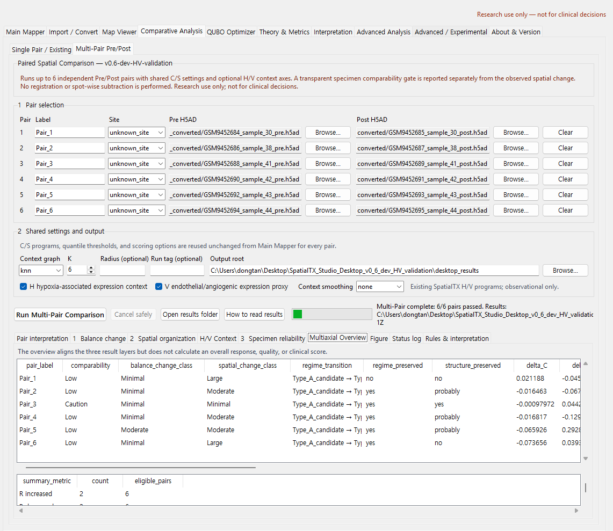
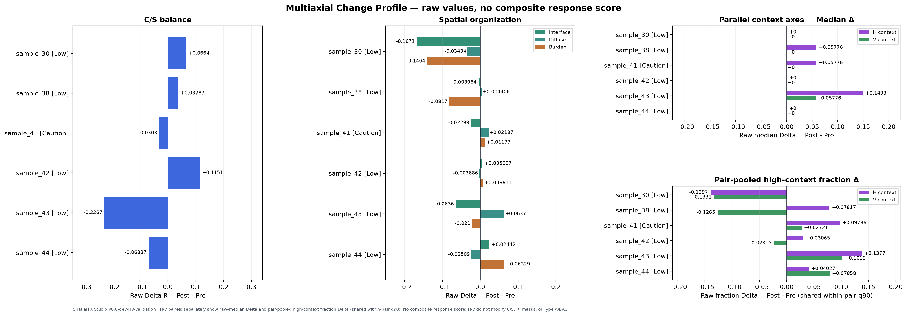
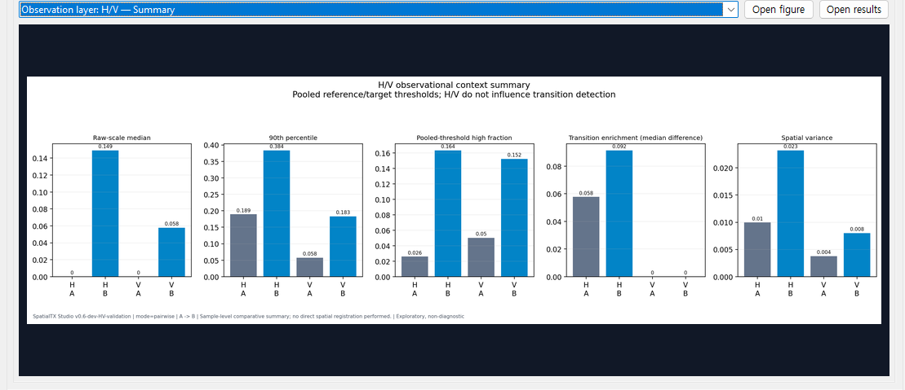
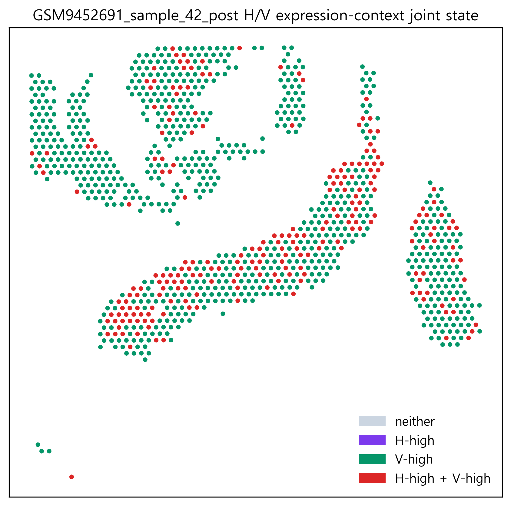
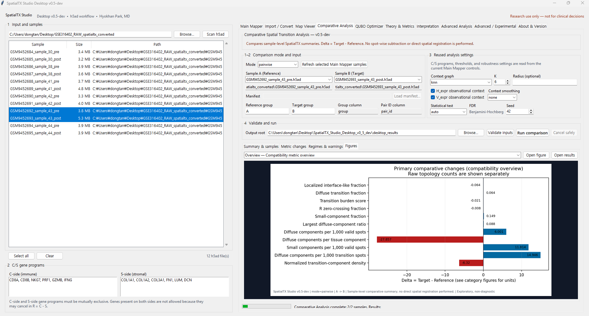
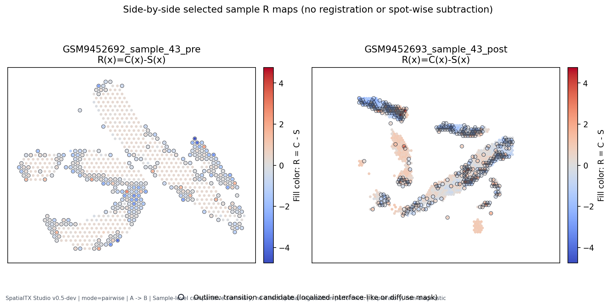
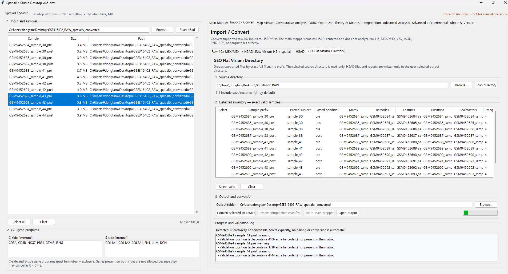

# SpatialTX Studio Desktop v0.6-beta

> Public source beta. Exploratory research use only.

v0.6-beta adds **Multiaxial Comparative Analysis + QC-aware paired interpretation** and an **H/V computational and audit validation layer**: effective genes, per-sample coverage/status, raw upper-tail summaries, within-pair pooled high-context fractions, and local high-context fractions. Import / Convert, Main Mapper, Single Pair Comparative Analysis, Advanced Analysis, graph tools, viewer, and existing output contracts remain available.

The v0.4 line adds an optional **Spatial Graph & Neighborhood — Experimental** module under Advanced Analysis. This module builds sparse spatial graphs, reports graph QC, calculates optional `H_expr` and `V_expr` context fields, and runs exploratory neighborhood statistics without changing Main Mapper C/S scoring or Type A/B/C behavior. v0.4.1-beta adds a read-only in-app viewer for its generated figures, context QC, and result files.

Windows desktop research prototype for the main `.h5ad` SpatialTX workflow.

- Creator: **Hyokhan Park, MD**
- Version: **v0.6-beta**
- Release date: **2026-08-12**
- Edition: **Public source beta**

The v0.6 screenshots were captured during final development testing and may show the internal `v0.6-dev-HV-validation` label. The published source identifies itself as `v0.6-beta`.

Multi-Pair Pre/Post workspace:



Multiaxial change profile with separate raw-value panels and no composite response score:



H/V observational context summary:



Example H/V expression-context joint-state map:



The screenshots below document the preserved v0.5 workflows.

Comparative Analysis metric changes:



Side-by-side `R(x) = C(x) - S(x)` maps; no registration or spot-wise subtraction is performed:



GEO Flat Visium Directory:



## Start on Windows

1. Double-click `install_desktop.bat` once to install the Python dependencies.
2. Double-click `run_desktop.bat` to open the application.

If dependencies are already installed, you can start it directly:

```powershell
python desktop_app.py
```

The launcher checks common Miniconda and Anaconda locations before the system Python.

## Import / Convert: raw inputs to H5AD

SpatialTX Studio uses AnnData .h5ad as its canonical analysis format. Raw 10x/Visium-format data can be imported through the Import / Convert workflow, which generates SpatialTX-compatible .h5ad files before analysis.

The Main Mapper does not analyze raw H5, MEX/MTX, CSV, JSON, PNG, RDS, or parquet files directly.

### Raw 10x MEX/MTX → H5AD

Select a folder containing:

- `matrix.mtx` or `matrix.mtx.gz`
- `barcodes.tsv` or `barcodes.tsv.gz`
- `features.tsv`, `features.tsv.gz`, `genes.tsv`, or `genes.tsv.gz`

If a compatible tissue-position table is available, its coordinates are attached. A MEX/MTX dataset without coordinates can still be converted for expression-only scoring, but H5AD validation reports a warning and spatial regimes, metrics, and maps remain unavailable.

### Raw Visium H5 + spatial → H5AD

Select a 10x/Visium sample folder containing:

- `filtered_feature_bc_matrix.h5`
- `spatial/tissue_positions.csv` or `tissue_positions.csv.gz`
- `spatial/scalefactors_json.json` or `scalefactors_json.json.gz`

Standard Space Ranger names and GEO-style prefixed names ending in these Visium filenames are accepted, for example `GSM9532669_SAMPLE_filtered_feature_bc_matrix.h5` and `GSM9532669_SAMPLE_tissue_positions.csv.gz`. Hires and lowres tissue PNG files are optional; uncompressed `.png` and `.png.gz` are supported.

### GEO Flat Visium Directory

Choose any readable local or mounted directory containing multiple flattened standard Visium samples whose files share exact prefixes, such as `GSM9452684_sample_30_pre_matrix.mtx` and `GSM9452684_sample_30_pre_tissue_positions.csv`. Recursive scanning is off by default. SpatialTX groups only files with the same complete prefix, shows valid/warning/invalid status, and converts only rows selected by the user.

The source directory is treated as read-only. Canonical mapping uses temporary storage outside the source; converted H5AD, image assets, inventory, validation report, JSON log, and conversion summary are written to the user-selected output folder. Existing H5AD files are never overwritten silently.

An optional comparative-manifest editor displays provisional accession, subject, and condition parsing. Pair ID, group, condition, batch, and notes remain editable. An unconfirmed draft leaves `group` and `pair_id` blank and records `pairing_source=filename_inference_unconfirmed`; only explicit user confirmation writes `pairing_source=user_confirmed` and enables direct handoff to Comparative Analysis. No analysis starts automatically.

See [docs/GEO_FLAT_VISIUM_IMPORT.md](docs/GEO_FLAT_VISIUM_IMPORT.md) for suffixes, validation rules, CLI examples, source-file safety, and limitations.

### Standard-folder shared conversion controls

The two standard-folder importer sections provide **Select input folder**, **Select output folder**, **Sample name**, **Convert to H5AD**, **Validate converted H5AD**, **Open output folder**, **Use in Main Mapper**, and a status log. The GEO flat section adds inventory scanning and multi-sample selection.

Seurat RDS, h5Seurat, parquet, and generic CSV import are not supported.

## Comparative Analysis: Multi-Pair Pre/Post

The existing **Single Pair / Existing** comparative workflow remains available. For multiple independent comparisons, open **Comparative Analysis → Multi-Pair Pre/Post**.

1. Configure one to six rows with a pair label, Pre H5AD, and Post H5AD.
2. Set site metadata to `same_site`, `different_site`, or `unknown_site`. A different site produces a warning but does not exclude the pair.
3. Leave unused rows completely empty. A partially filled row produces a clear warning.
4. Confirm the shared C/S programs and thresholds in Main Mapper. Multi-Pair never changes parameters between pairs.
5. Enable H and/or V only when the optional observational context is desired. Existing SpatialTX H/V gene programs are reused; missing context genes do not fail the core comparison.
6. Choose an output root and select **Run Multi-Pair Comparison**.
7. Review **1 Balance change**, **2 Spatial organization**, **H/V Context**, **3 Specimen reliability**, and **Multiaxial Overview** without collapsing them into one score.
8. Open **Pair interpretation** for `Minimal/Moderate/Large` change classes, regime/structure preservation, `GOOD/CAUTION/LOW` interpretation confidence, site warning, and pair-specific safety messages.
9. Select **How to read results** (or open **Rules & interpretation**) for the exact layer definitions, change-class thresholds, Good/Caution/Low rules, Delta direction, C/S/R summary basis, H/V limits, and interpretation limits used by this version.

Each pair retains Pre, Post, Delta (`Post - Pre`), safe percent-change status, and a metric-aware direction symbol. Layer 1 reports C, S, and R separately. Primary C/S/R rows use existing field medians because within-sample field means may be approximately zero after gene-wise standardization; mean values remain separate compatibility columns. Layer 2 reports coordinate-dependent spatial organization metrics. Layer 3 reports `Good`, `Caution`, or `Low` specimen reliability with auditable reasons based primarily on technical quality, tissue sampling, occupancy, gene coverage, and geometry proxies. C/S distribution is labeled as a secondary `composition proxy` and cannot by itself produce `Low`.

One failed pair does not terminate the others. Numerical results are not suppressed when specimen reliability is Low; they are flagged because sampling or composition differences may substantially influence the observed change. Reliability qualifies interpretation but is not itself a biological outcome. The three layers are not combined into one score and do not establish treatment response, clinical benefit, efficacy, responder status, or drug sensitivity.

The **Specimen reliability** tab displays actual spot-count, detected-gene, observed-count, spatial-extent, tissue-component, and occupancy comparisons where available. Technical mismatch, sampling mismatch, and `composition proxy` context are separated. If explicit patient/sample-like filename IDs disagree, the application asks the user to confirm the pair and retains a visible `Possible pair-ID mismatch` warning without automatically blocking the run.

The run folder retains all v0.6 files and adds `context_gene_audit.csv`. `context_changes.csv` and `multiaxial_pair_summary.csv` now include raw H/V median, q90, pair-pooled high-context fraction, local high-context fraction, gene coverage, and explicit status. Raw Pre, Post, and Delta values are preserved. In the multiaxial figure, the H/V area uses two independently scaled tiers: raw-median Delta and pair-pooled high-context fraction Delta. This keeps focal upper-tail change visible when a whole-tissue median remains zero; no composite response score is computed.

For each axis and pair, the common high-context threshold is `q90(concat(Pre raw context, Post raw context))`. Pre and Post high fractions use that same threshold. A local high-context spot is above the shared threshold and has at least one graph neighbor that is also above it. These calculations are repeated independently for each pair; thresholds are not shared across patients.

`context_gene_audit.csv` separates the legacy within-sample centered-context q80 diagnostic from the within-pair raw-context q90 summary. The columns `single_sample_context_warning` and `pair_pooled_context_warning` have explicit provenance, and their corresponding high fractions are exported separately. A legacy single-sample warning such as `100.0%` therefore does not mean that the pair-pooled high-context fraction is 100%.

## Workflow

1. Choose a folder and scan recursively for `.h5ad` files.
2. Select one or more samples in the table.
3. Edit the C-side and S-side gene programs if needed.
4. Run scoring to create a summary CSV, per-sample metrics, selected-gene tables, and six-panel PNG maps.
5. Select exactly one sample to optimize either the C-side or S-side program.
6. Apply the optimized genes and recompute/redraw the selected samples.
7. Export the latest result as a folder or ZIP archive.

C-side and S-side programs must be mutually exclusive. Input is normalized by trimming whitespace, converting symbols to uppercase, removing within-program duplicates, and preserving first occurrence order. If the same gene appears on both sides, Main Mapper, Advanced Analysis, Spatial Graph, CLI, and QUBO follow-up execution are blocked until the user removes it from one side. This is required because a shared signal may cancel in `R=C-S`.

The application includes ten working tabs and is designed around a Full HD desktop:

- **Main Mapper** — H5AD inputs, C/S programs, thresholds, scoring execution, logs, and export
- **Import / Convert** — converts Raw 10x MEX/MTX, Raw Visium H5 + spatial, or prefix-grouped GEO flat Visium inputs to canonical H5AD before analysis
- **Map Viewer** — displays generated PNG maps inside the application with sample navigation and fit-to-window scaling
- **Comparative Analysis** — pairwise, paired-group, unpaired-group, and manifest-based sample-level comparisons using the canonical Main Mapper engine
- **QUBO Optimizer** — reproducible single-seed selection plus optional multi-seed stability analysis, independent C/S application, restoration of the original fixed gene sets, and explicit recompute/map redraw
- **Theory & Metrics** — the C/S/R/G model, interface rules, regimes, metric interpretation, optimizer rationale, and the assumptions and limitations of Advanced Analysis
- **Interpretation** — a sample summary table, automatically generated result explanation, gene-coverage warning, review checklist, and direct access to each PNG map
- **Advanced Analysis** — gene composition, interface enrichment, local Cx/Sx spatial interaction, Spatial Graph & Neighborhood, and a results dashboard
- **Advanced / Experimental** — opt-in non-spatial expression candidate contrast, heuristic candidate filtering, and local ligand/receptor utility exports
- **About & Version** — creator, current version/date, release description, and research-use notice

## Comparative Spatial Transition Analysis

The Comparative Analysis tab reuses the current C/S genes, thresholds, normalization, smoothing, and robustness settings. Choose a pair of selected Main Mapper H5AD files, or load a CSV manifest for paired, unpaired, or manifest-batch analysis. The UI validates inputs in a background thread, displays invalid samples, supports safe cancellation between sample computations, and opens timestamped results without blocking the desktop interface.

The default comparison unit is the sample-level summary. Delta is defined as `Target - Reference`. Spatial maps are displayed side by side with a shared `R(x)` color scale, but coordinates are not assumed to correspond and spots are never subtracted directly. The report always states: “Sample-level comparative summary; no direct spatial registration performed.”

Comparative figures are now grouped by compatible metric category: program scores, transition, graph, raw topology, normalized topology, sample scale, relative change, standardized heatmap, regime, R maps, and H/V observation context. The default raw-Delta overview itself is split into **Primary spatial-state summary metrics** and **Topology / component complexity metrics** panels with independent x-axes and a numeric label on every bar. This prevents component-density changes from visually flattening fraction/score changes. Eligible group analyses also receive a separate pooled-sample-scale standardized overview; pairwise z-scores are not invented. The Metric changes table retains reference and target values and raw deltas while adding standardized Delta where valid, normalized counterparts, symmetric percent change, scale-sensitivity flags, and warnings. Raw topology counts are never removed, but they should be interpreted only after checking valid spot count, tissue extent, tissue graph-component count, and normalized component density.

Group reports include sample count, mean, median, standard deviation, interquartile range, effect size, seeded bootstrap 95% confidence interval, test result, and Benjamini-Hochberg-adjusted p-value where calculable. Wilcoxon signed-rank is the default for matched pairs; Mann-Whitney U is the default for unpaired groups. Optional paired or Welch t tests must be selected explicitly. Small groups are warned, and statistical significance is not interpreted as biological significance.

`H_expr` and `V_expr` remain optional observational expression context. Missing genes produce warnings rather than a failed core comparison. H/V never redefine `R(x)`, transition masks, transition burden, or Type A/B/C candidate regimes.

Within-sample centered H/V means are expected to approach zero and are omitted from primary comparative figures. When non-centered expression scores are available, the desktop shows medians, 90th percentiles, pooled reference/target high-score fractions, transition enrichment, and variability. These summaries remain observational only.

See [docs/COMPARATIVE_ANALYSIS.md](docs/COMPARATIVE_ANALYSIS.md) and [examples/comparative_manifest_example.csv](examples/comparative_manifest_example.csv) for inputs, commands, output definitions, limitations, and troubleshooting.

### QUBO option guide

- **Genes (k)**: fixed number of genes selected for the optimized side. Smaller values produce a more compact program; larger values retain broader signal but may add redundancy. Default: 8.
- **Pool**: maximum candidate genes considered by the optimizer. A larger pool broadens the search but increases computation and potential instability. Default: 40.
- **Iterations**: simulated-annealing swap attempts. More iterations can improve the search at the cost of runtime; this does not change the requested number of selected genes. Default: 1,000.
- **Seed**: fixes the single-run random search path. In multi-seed mode it is the first sequential seed. Default: 20260624.
- **Multi-seed runs**: number of repeated optimizer runs used to evaluate seed sensitivity. Default: 10.
- **Consensus threshold**: minimum selection frequency for a gene to be classified as a consensus core gene. Default: 0.80.

When the starting seed is a valid `YYYYMMDD` value, multi-seed mode advances it by calendar day. The default 10-run sequence is therefore `20260624` through `20260630`, followed by `20260701`, `20260702`, and `20260703`. Genes meeting the selected threshold are `consensus_core`; genes selected in at least half of runs are `moderately_stable`; lower-frequency genes are `seed_sensitive_alternative`.

### How QUBO optimization works

1. Build a bounded candidate gene pool.
2. Score genes for C/S alignment, directional `R`, gradient association, spatial enrichment, detection, and variance.
3. Hard-exclude genes already assigned to the opposite side, then penalize opposite-side correlation, low detection, and redundant gene pairs.
4. Formulate a binary optimization problem that selects exactly `k` genes.
5. Solve it locally with a classical simulated-annealing heuristic.
6. Apply the selected program, recompute the C/S fields, and redraw the maps.

QUBO does not simply rank genes independently. It selects a complementary combination that explains the requested spatial direction while limiting redundancy.

Multi-seed mode exports every seed-level gene set and QUBO energy, gene selection frequency, pairwise gene-set overlap, R-field correlation, interface-mask agreement, regime agreement, consensus core genes, and an exact-k consensus set. QUBO energy is minimized, so lower values are better only when the input, candidate pool, objective weights, and parameters are identical. A stable multi-seed result is a computational robustness result, not biological validation.

The scoring implementation uses per-gene z-scores, C/S program means, `R=C-S`, a six-neighbor spatial graph, local balance gradient `G`, and quantile-based localized-interface and diffuse-transition calls. The optimizer uses a side-aware, fixed-cardinality QUBO-inspired objective with a classical simulated-annealing fallback. It is not a quantum backend.

Every scored sample receives a `QC_flag`, `spatial_qc_status`, and machine-readable `QC_notes`. Checks cover C/S gene coverage, coordinate validity, unique feature names, and very small spot counts. C/S program overlap is not downgraded to a QC warning: it is a preflight and core-engine hard error.

If `adata.obsm["spatial"]` is missing, empty, non-finite, or not shaped `(n_obs, 2)`, the Main Mapper does not invent fallback geometry. Expression-only C/S/R scoring remains available when gene-program coverage is sufficient, while the regime is set to `Spatial_QC_incomplete`. Type A/B/C calls, localized interface-like candidates, transition metrics, spatially informed QUBO optimization, and spatial maps are not generated. The sample report separates expression-only results from unavailable spatial results.

### Robustness and memory-safety options

Main Mapper includes optional diagnostics that leave the default workflow unchanged:

- **Smoothing**: `none` by default; optional kNN mean or Gaussian spatial smoothing uses `adata.obsm["spatial"]`.
- **Normalization**: `raw_mean` by default, meaning no additional C/S field normalization beyond the established gene-score pipeline; optional `z_score` or `rank_quantile` normalizes the final C/S fields.
- **Threshold perturbation**: off by default. When enabled, the app evaluates `C_Q_LIST = [0.75, 0.80, 0.85]`, `S_Q_LIST = [0.75, 0.80, 0.85]`, and `G_Q_LIST = [0.50, 0.60, 0.70]` and reports `dominant_regime`, `regime_stability`, `dominant_typeB_subtype`, and `subtype_stability`.
- **Parameter log export**: on by default. Each sample receives `parameter_log.json` with software version, input path, output folder, sample name, requested and used gene programs, overlap status/policy, within-program duplicate removal, smoothing/normalization settings, thresholds, perturbation grid, matrix shape/storage, dense-memory estimates, and timestamp.
- **Memory preflight**: AnnData matrix shape and sparse/dense storage are inspected before scoring. SpatialTX estimates dense float32/float64 memory, warns about risky dense conversion, avoids full `AnnData.X` dense conversion, and extracts only selected C/S genes for scoring.

Threshold stability is a parameter-sensitivity diagnostic only. It does not validate biological subtype, mechanism, clinical relevance, or treatment response.

## Spatial Graph & Neighborhood — Experimental

The v0.4 graph workflow is opt-in and lives under **Advanced Analysis → Spatial Graph & Neighborhood — Experimental**.

These analyses provide exploratory spatial association and organization summaries. They do not establish causal, physical, or biological cell-cell interactions.

It supports:

- radius graphs with explicit native/pixel/micrometer unit and calibration provenance;
- Visium lattice graphs when `array_row` and `array_col` metadata are valid;
- symmetric KNN graphs as a robustness option;
- binary, inverse-distance, and Gaussian edge weighting;
- graph QC based primarily on edge count, degree, isolated spots, connected components, nearest-neighbor distances, and edge distances; graph density is informational and is not a standalone low-density failure criterion;
- categorical neighborhood enrichment;
- binary-mask same-spot overlap and neighboring-spot association;
- continuous edge statistics for C/S/R and optional H/V context fields.
- generic continuous X–Y edge association for user-selected `adata.obs` columns;
- whole-slide, connected-component-aware, or user-stratified permutation;
- input audit, four explicit variable semantics, separate same-spot/neighbor/continuous exports, and optional radius/lattice/KNN robustness comparison.

`H_expr` is a hypoxia-associated expression field. `V_expr` is an endothelial/angiogenic expression proxy. `V_expr` is not a direct measure of vessel density, perfusion, or functional blood supply. They are context layers only and do not alter `R(x)`, Type A/B/C classification, Type B internal patterns, or existing transition masks.

Neighborhood enrichment uses seeded permutation with the corrected empirical P-value `(extreme_count + 1) / (n_permutations + 1)`. Reported P-values and FDR values are exploratory spatial association summaries, not evidence of causal biological interaction.

Graph-smoothed context fields are intended for visualization and exploratory sensitivity analysis. Association statistics computed on fields smoothed over the same graph may be inflated and should not be interpreted as independent confirmatory evidence.

Permutation P-values are exploratory and rely on exchangeability assumptions. They do not fully preserve the original spatial autocorrelation structure. BH-FDR is applied within one sample and one analysis table (`within_sample_within_analysis_table`), not jointly across samples, graph types, analysis families, or robustness runs.

Detailed notes are in [docs/SPATIAL_GRAPH_NEIGHBORHOOD.md](docs/SPATIAL_GRAPH_NEIGHBORHOOD.md), [docs/INPUT_AUDIT_AND_VARIABLE_SEMANTICS.md](docs/INPUT_AUDIT_AND_VARIABLE_SEMANTICS.md), and [docs/OUTPUT_SCHEMA_v0_4.md](docs/OUTPUT_SCHEMA_v0_4.md).

## Spatial Graph Results workflow

1. Select one or more H5AD samples.
2. Open **Advanced Analysis**.
3. Open **Spatial Graph & Neighborhood — Experimental**.
4. Configure graph and optional H_expr/V_expr settings.
5. Run **Spatial Graph & Neighborhood**.
6. After completion, the app automatically opens **Spatial Graph Results**.
7. Select a sample and figure.
8. Review H_expr/V_expr context QC.
9. Use **Open image** or **Open results folder** when needed.

The first successful sample and its highest-priority available figure are selected automatically. The H/V joint high-state map is preferred; when it is absent, the viewer falls back to H_expr, V_expr, neighborhood enrichment, graph QC, smoothed/unsmoothed context maps, and then other PNGs. Samples that failed or were cancelled appear in a separate area without blocking successful samples. Existing PNG, CSV, and JSON files remain in the timestamped output folder. The viewer reads those files without changing the v0.4 output schema or analysis calculations.

## Output layout

Each run creates a timestamped folder under the chosen output root:

```text
spatialtx_run_<timestamp>/
  spatialtx_summary.csv
  run_config.json
  RUN_INFO.txt
  <sample>/
    metrics.csv
    parameter_log.json
    selected_genes.csv
    robustness_perturbation.csv   # only when perturbation check is enabled
    <sample>_spatialtx_maps.png
```

Optimizer detail and summary CSVs plus a machine-readable single-seed summary JSON are stored under `optimizer/` in the latest run folder when available. They record whether the overlap constraint was enabled, genes excluded because they belong to the opposite side, and the final overlap count.

The v0.4 graph module writes separate timestamped `spatial_graph_neighborhood_*` folders containing `spatial_graph/`, `neighborhood/`, `context_fields/`, `figures/`, and optional `annotated/` outputs. Existing Main Mapper result folders are unchanged when the graph module is not enabled.

## Opt-in Advanced tools

Advanced tools are disabled by default and require an explicit enable checkbox. They include:

- non-spatial two-H5AD expression candidate contrast
- receptor-like/membrane filtering and QUBO candidate-pool handoff
- sequence-annotation templates and ligand/receptor candidate skeletons
- FASTA/template export when sequence data are supplied
- read-evidence review-plan generation

Raw data conversion is intentionally not part of Advanced tools; it has moved to **Import / Convert**.

The earlier filename-based A1 pre/post pair scanner is no longer displayed in Advanced / Experimental. Use **Comparative Analysis** for reviewed Sample A/Sample B, paired-group, unpaired-group, or manifest-based spatial comparisons.

### A3-A5 hypothesis-generation flow

- **A3 — Exploratory expression candidate contrast (non-spatial):** ranks shared genes between a user-selected Reference and Target H5AD using normalized mean-expression contrast and detection-fraction change. It does not compare C/S/R fields, transition metrics, topology, or registered spots.
- **A4 — Receptor-like/membrane filter:** applies lightweight gene-symbol heuristics to prioritize receptor-like, membrane-associated, transporter-like, and surface-like candidates for follow-up review.
- **A5 — Export candidate pool to QUBO:** preserves candidate metadata, writes a bounded QUBO input table, and loads its gene list into downstream C-side or S-side combination selection.

A3-A5 are optional advanced hypothesis-generation utilities. They do not validate drug response, receptor function, ligand-receptor binding, read-level evidence, or clinical biomarkers. A3 candidates should be described as condition-associated or exploratory candidates, and its output must not be presented as a spatial comparative result. A4 results should be described as receptor-like or membrane-associated candidates, not discovered or validated receptors.

The ligand/receptor and sequence utilities are local template/skeleton generators. They do not query or validate against external biological databases.

This software is for exploratory research use only and is not intended for diagnosis, treatment selection, or clinical decision-making.
